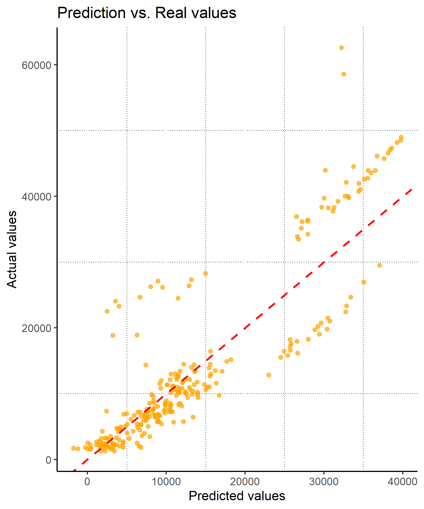
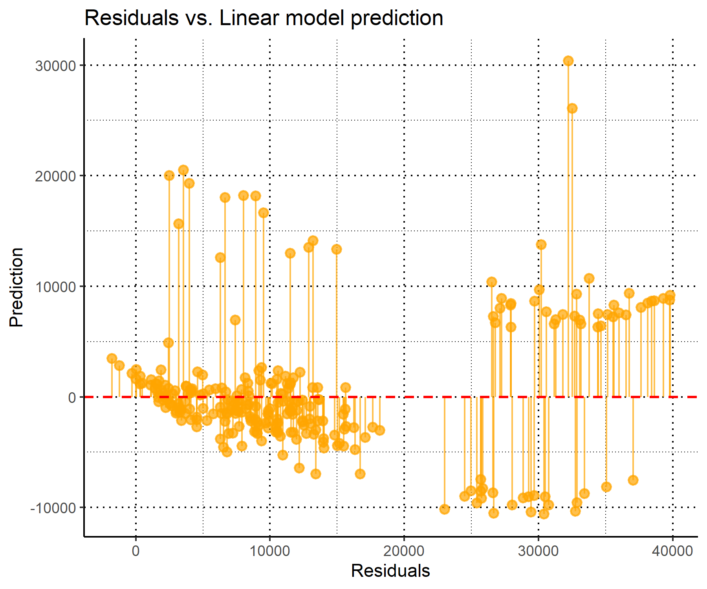

# Overview
Exploratory data analysis (EDA) of a mock healthcare insurance dataset containing health insurance charges and basic information of individuals around the US. My aim was to create a predictive model predicting healthcare charges based on a variety of variables relating to individuals lifestyle, demographic, and medical history. 

This dataset, titled "Medical Cost Personal Dataset", was sourced from Kaggle and created by Miri Choi. It is licensed under the Open Data Commons Attribution License (ODC-By) and can be be accessed with this link [https://www.kaggle.com/datasets/mirichoi0218/insurance/data].

EDA consisted of the following: 
1. Checking distribution of charges vs biological sex, region, # number of children etc.
2. Analysing the correlation b/w insurance charges and variables such as whether or not one smokes, biological sex, and region
3. Creating a model using machine learning to predict insurance charges based on variety of factors

# Results and Methods 

Model to predict health insurance costs (HIC) 

To create a model for insurance costs I used the lm() function. Here is what I found:
- BMI amount of children, and smoking status all influence HIC (p < 0.05)
- Biological sex and region have no significant impact (p > 0.05) 
- 75.7% of variation in health insurance costs can be explained by the model (r^2 = 0.757) 

Here is a scatter plot of the model against actual healthcare costs: 

The model had an RMSE of 5965.24, which was lower than the standard deviation (12110.00)

